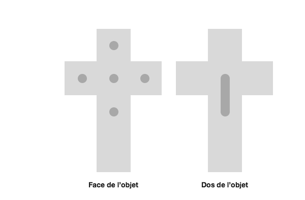
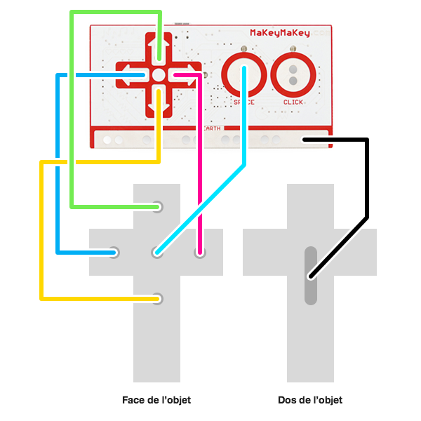

# Chapelle Nomade (HackMyChurch)
Projet « Chapelle nomade »

---

## Dispositif

Ce dispositif est situé dans une chapelle nomade, dans un espace clos. Le `crucistick` est un contrôleur à une main qui permet à l'utilisateur de switcher entre plusieurs modes affichés à l'écran, comme la *contemplation* ou la *contempl'action*. Ainsi, l'utilisateur peut vivre une expérience individuelle.

Techniquement, l'utilisateur exploite le `crucistick` pour interagir avec un script Processing qui propose deux modes : l'un joue une vidéo en boucle (contemplation), l'autre fait défiler des grandes images dans lesquelles l'utilisateur peut se déplacer avec le `crucistick` (contempl'action).

## Fonctionnement

Le dispositif prototype est constitué de :

* Un écran
* Un ordinateur
* Un Makey Makey
* Une mini chapelle en carton et en bois
* Un `crucistick` en carton, avec des zones métalliques conductrices

## Électronique

Le Makey Makey est très pratique pour simuler des touches sans passer par un nouveau réseau Arduino à créer de toute pièce. Ainsi, le Processing est attentif aux 4 touches fléchées du clavier et à la touche `Espace`. Le Makey Makey est branché à l'ordinateur faisant tourner le Processing.

Le `crucistick` est un objet en forme de croix latine disposant de 5 zones conductrices au contact de la main. L'objet tient dans la main, et peut au choix contenir la carte Makey Makey ou être relié à elle par des câbles.

Le branchement de la Makey Makey est très simple :
* `Haut` est relié au point de la branche en haut de la croix
* `Gauche` est relié au point de la branche gauche de la croix
* `Bas` est relié au point de la branche vers le bas de la croix
* `Droite` est relié au point de la branche droite de la croix
* `Espace` est relié au point au centre de la croix
* `Ground/Terre` est relié au point à l'arrière de l'objet

Pour rappel : sur cette Makey Makey, pour que le contact se fasse lorsque l'utilisateur touche un point métallique, il doit également être en contact avec un point métallique relié à la terre (ground). C'est pour ça que le point métallique connecté à `Ground/Terre`de la Makey Makey est derrière l'objet : l'utilisateur saisissant l'objet d'une main, il touche ainsi la terre avec sa paume.
